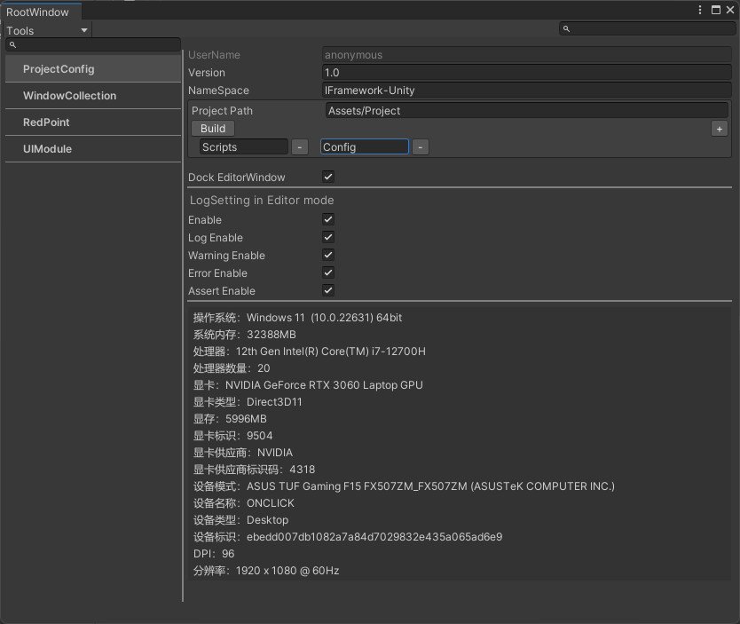

# 安装
* upm 添加包地址 https://gitee.com/OnClick9927/IFramework-Unity.git#src
* upm 添加包地址 https://github.com/OnClick9927/IFramework-Unity.git#src

# 设置
* 打开面板 ctrl+shift+i
* 参数

| 参数              | 描述                      |
| ----------------- | ------------------------- |
| UserName          | 用户名字（unity账户名字） |
| Version           | 工程的版本                |
| NameSpace         | 工程命名空间              |
| Project Path      | 项目内容所在文件夹        |
| Build             | 构建工程目录              |
| Dock EditorWindow | 打开的窗口是否依附        |
| Enable            | log 总开关                |
| Log Enable        | 开启log                   |
| Warning Enable    | 开启Warning               |
| Error Enable      | 开启Error                 |

