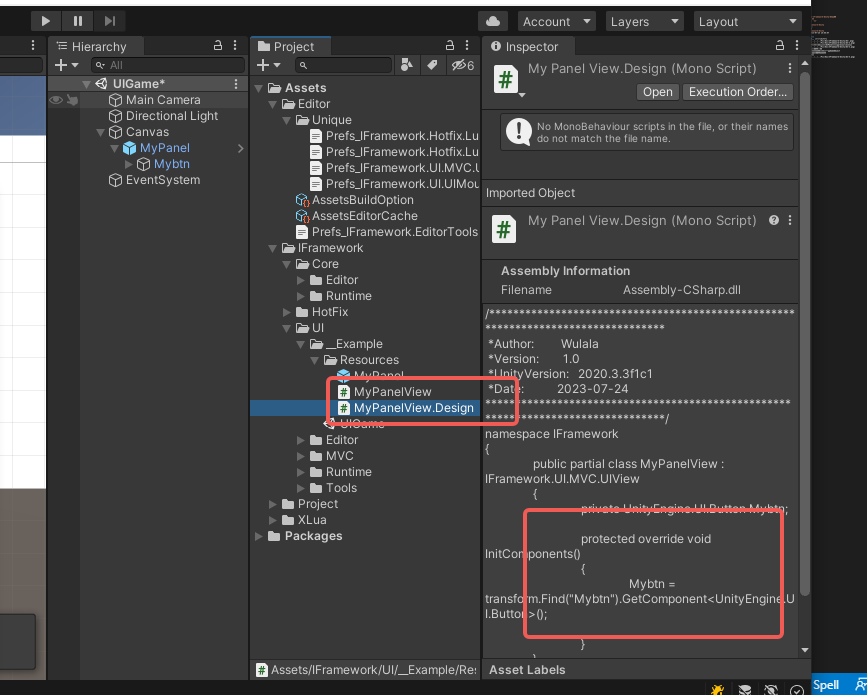

# 预制体制作代码生成
* 打开面板 ctrl+shift+i
* 做好预制体，挂上脚本UIPanel，拽到resources目录
* 拽如脚本生成路径
* 选择好刚刚的预制体，放到GameObject
* 标记好需要生成的组件
* 点击 Gen
* 生成代码 如 ui-5
* 设置好ui层级 并点击save to file
* 点击生成 UI 名字 如 ui-7





# 运行时代码
## 加载出来界面
``` csharp
public class MyUIAsset : UIAsset
{
    PanelPathCollect collect;

    public MyUIAsset(PanelPathCollect collect)
    {
        this.collect = collect;
    }
    ///界面层级获取
    public override UILayer GetPanelLayer(string path)
    {
        return collect.datas.Find(x => x.path == path).layer;
    }
    public override int GetPanelLayerOrder(string path)
    {
        return collect.datas.Find(x => x.path == path).order;
    }
    

    //如何加载出来界面
    public override UIPanel LoadPanel(string name)
    {
        return Resources.Load<UIPanel>(name);
    }
///下面是异步
    public override bool LoadItemAsync(string path, LoadItemAsyncOperation op)
    {
        return false;
    }
    public override bool LoadPanelAsync(string name, LoadPanelAsyncOperation op)
    {
        return false;
    }
}
///加载代码
public TextAsset text;
///创建模块
UIModule ui = Launcher.modules.GetModule<UIModule>();
///设置UI资源
ui.SetAsset(new MyUIAsset(JsonUtility.FromJson<PanelPathCollect>(text.text)));
///设置UI书写模式
MvcGroups mvc = new MvcGroups(new Dictionary<string, Type>()
{
    { PanelNames.MyPanel, typeof(MyPanelView) },
});

ui.SetGroups(mvc);
///创建画布
ui.CreateCanvas();
///打开界面
ui.Show(PanelNames.MyPanel);
```
## 界面方法书写
``` csharp
public partial class MyPanelView
{
  ///界面加载出来绑定按钮
  protected override void OnLoad()
  {
    this.BindButton(this.Mybtn, () =>
    {
      UnityEngine.Debug.Log("Click");
    });
  }

  protected override void OnShow()
  {
  }

  protected override void OnHide()
  {
  }

  protected override void OnClose()
  {
  }

}
```
## 运行
