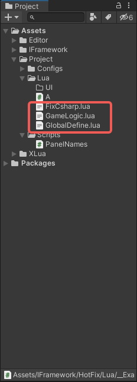

# 代码
``` csharp
public class AssetsLoader : IXLuaLoader
{
    public static string projectScriptsPath
    {
        get { return Application.dataPath.CombinePath("Project/Lua"); }
    }
    public byte[] load(ref string path)
    {
        if (path.EndsWith(".lua"))
            path = path.Replace(".lua", "");
        path = path.Replace(".", "/");
        string filepath = $"{path}.lua";
        var textAsset = Resources.Load<TextAsset>(filepath);
        if (textAsset != null)
            return textAsset.bytes;
        filepath = projectScriptsPath.CombinePath(filepath + ".txt").ToAssetsPath();
#if UNITY_EDITOR
        var handle = UnityEditor.AssetDatabase.LoadAssetAtPath<TextAsset>(filepath);
        return handle.bytes;
#endif
        return null;
    }
}

public class LuaGame : Game
{
    public class UnityModules
    {
        public XLuaModule Lua { get { return Launcher.modules.GetModule<XLuaModule>(); } }
    }

    public UnityModules unityModules = new UnityModules();

    public override void Init()
    {

    }
    public override void Startup()
    {   
        /// 创建模块，设置lua 文件加载器
        unityModules.Lua.AddLoader(new AssetsLoader());
        ///开始Lua 模块
        new XluaMain(unityModules.Lua);
    }
}

```
## 调用
* XluaMain 会依次调用
  * FixCsharp.lua
  * GlobalDefine.lua
  * GameLogic.lua
* 其他：请参阅Xlua



## 其他部分
### Lua 提供的方法
* class  （lua class）
* handler （方法句柄）
* try （仿造C# 的try）
* async/ await/luaTask （lua 内的多线程实现）
* StaticUsing  （类似 C# 的static using ，参照 UI生成的代码）
* EventSystem （消息事件）
* Json （纯lua 的jason 序列化）
* Log  (框架输出)

### UI
* UI 与 C# 部分保持高度雷同， 不同点在于
  * lua 生成出来的 组件会统一放在 Controls 内
  * 设置代码的组需要是lua内的 LuaGroups_MVC ui.SetGroups(mvc);


``` lua
-- 设置代码组
local UI = Game.modules.UpdateUI
local map =
{
    { Name = PanelNames.UpdatePanel, ViewType = require("Update.UpdatePanelView") },
}
local groups = LuaGroups_MVC()
UI:SetGroups(groups:SetMap(map))
```

``` lua
--*********************************************************************************
--Author:         Wulala
--Version:        1.0
--UnityVersion:   2020.3.3f1c1
--Date:           2023-07-24
--*********************************************************************************

---ViewUseFlag
local Button = StaticUsing("UnityEngine.UI.Button")

---ViewUseFlag
---@class MyPanelView : UIView_MVC
local MyPanelView = class("MyPanelView",UIView_MVC)

function MyPanelView:OnLoad()
	self.Controls = {
		---@type UnityEngine.UI.Button
		Mybtn = self:GetComponent("Mybtn", typeof(Button)),
	}

end

function MyPanelView:OnShow()

end

function MyPanelView:OnHide()

end

function MyPanelView:OnClose()
	self.Controls = nil
end

return MyPanelView
```
