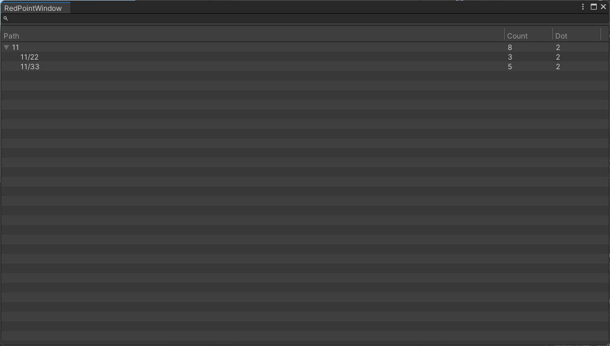

``` csharp
    //自定义绑定，显示节点对应的数字
  private class Dot : RedDot
    {
        public Text text;

        public Dot(string path, Text text)
        {
            this.text = text;
            SetPath(path);
        }

        public override void FreshView(int count)
        {
            text.text = count.ToString();
        }
    }  

public class redPointGame : Game
{
    public Toggle add;
    public List<Button> btns = new List<Button>();
    public List<string> keys = new List<string>() {
    "11",
    "11/22",
    "11/33",
    };

    public override void Init()
    {
      //读入红点路径
        for (int i = 0; i < keys.Count; i++)
               RedTree.ReadPath(keys[i]);
  //对按钮挨个绑定
        for (int i = 0; i < btns.Count; i++)
        {
            var index = i;
            var btnsNode = btns[i];
            var key = keys[index];
            var text = btnsNode.GetComponentInChildren<Text>();
            new Dot(key, text);//自定义显示数字的绑定
            //控制显示隐藏的绑定
            //当数字小于0会隐藏
            new RedActiveDot(key, text.gameObject);
          
            btnsNode.onClick.AddListener(() =>
            {
                //按钮点击对红点数据修改
            //注意只有叶子节点修改会起效
                RedTree.SetCount(key, RedTree.GetCount(key) + (add.isOn ? 1 : -1));
            });


        }

    }

    public override void Startup()
    {

    }
    private void OnGUI()
    {
      //红点编辑器窗口
        if (GUILayout.Button("open WIndow", new GUIStyle("button") { fontSize = 40 }, GUILayout.Height(300), GUILayout.Width(300)))
        {
            IFramework.EditorTools.EditorWindowTool.Create("RedPoint");

        }
    }

}

```

* path 红点路径
* count 当前数量
* dot  有几个绑定