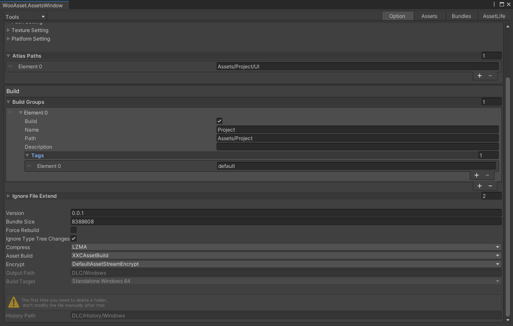

# 第一次使用
* 打开编辑器窗口，操作如下图
* 如果报错，关闭窗口再打开一次即可
* 如果成功了，会在Assets/Editor目录下看到两个配置文件

# 配置资源

| 名字                    | 描述                                                             |
| ----------------------- | ---------------------------------------------------------------- |
| BuildGroups             | 打包的资源组                                                     |
| ignoreFileExtend        | 不需要打包的文件后缀                                             |
| Version                 | 此次打包出去的版本                                               |
| Bundle Size             | 打出来的bundle最大大小                                           |
| ignore Type Tree change |                                                                  |
| Compress                | 资源压缩格式                                                     |
| Asset Build             | 自定义打包流程（可扩展）                                         |
| Encrypt                 | 文件加密方式（可扩展）                                           |
| Output Path             | 输出路径                                                         |
| Build Target            | 当前打包的平台                                                   |
| History Path            | 历史文件所在文件夹，第一次打包时候把他删了，后续不要动里面的文件 |
## 资源组介绍
| 名字        | 描述                                   |
| ----------- | -------------------------------------- |
| Build       | 该组是否需要打包 （给分布式打包使用）  |
| Name        | 组的名字（不可重复，不为空）           |
| Path        | 组对应的项目路径  （不可重复，不为空） |
| Description | 对组加点描述                           |
| Tags        | 对组加一些标记                         |

* 每个资源组均可以分开打包，更新，加载
* 保持好良好的资源组结构，方式生成过多冗余