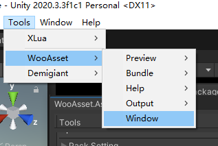
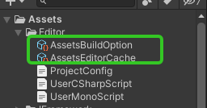
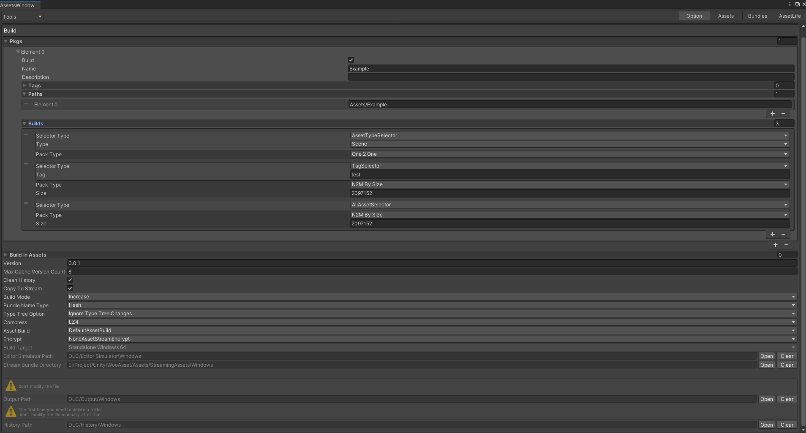

# 第一次使用
* 打开编辑器窗口，操作如下图
* 如果报错，关闭窗口再打开一次即可
* 如果成功了，会在Assets/Editor目录下看到两个配置文件

# 配置资源

| 名字                    | 描述                                                                               |
| ----------------------- | ---------------------------------------------------------------------------------- |
| Pkgs                    | 打包的资源包                                                                       |
| BuildInAssets           | 在把bundle拷贝到stream时候，根据这个配置决定拷贝哪些bundle（不配置拷贝全部）       |
| Version                 | 此次打包出去的版本                                                                 |
| MaxCacheVersionCount    | 远程版本文件最多包含的版本个数                                                     |
| CleanHistory            | 每次打包结束之后是否清理history文件夹                                              |
| Copytostream            | 拷贝资源到stream，如果  BuildInAssets未配置会拷贝所有，否则会更具BuildInAssets沙宣 |
| build mode              | 打包模式（是否增量式）                                                             |
| bundle name type        | 输出资源名称风格（名/名_Hash/Hash）                                                |
| type tree option        | 资源类型信息                                                                       |
| Compress                | 资源压缩格式                                                                       |
| Asset Build             | 自定义打包流程（可扩展）                                                           |
| Encrypt                 | 文件加密方式（可扩展）                                                             |
| Build Target            | 当前打包的平台                                                                     |
| Editor Simulator Path   | 编辑器模拟路径                                                                     |
| Output Path             | 输出路径                                                                           |
| History Path            | 历史文件所在文件夹，第一次打包时候把他删了，后续不要动里面的文件                   |
| stream bundle directory | stream保存资源的文件夹                                                             |

## 资源组介绍
| 名字        | 描述                                                            |
| ----------- | --------------------------------------------------------------- |
| Build       | 该组是否需要打包 （给分布式打包使用）                           |
| Name        | 包的名字（不可重复，不为空）                                    |
| Paths       | 对应的项目路径  （不可重复，不为空）                          |
| Description | 对包加点描述                                                    |
| Tags        | 对包加一些标记                                                  |
| builds      | 分包规则       （也可以纯粹代码分包，但是此项目不可以存在配置） |

* 每个资源组均可以分开打包，更新，加载
* 保持好良好的资源组结构，方式生成过多冗余