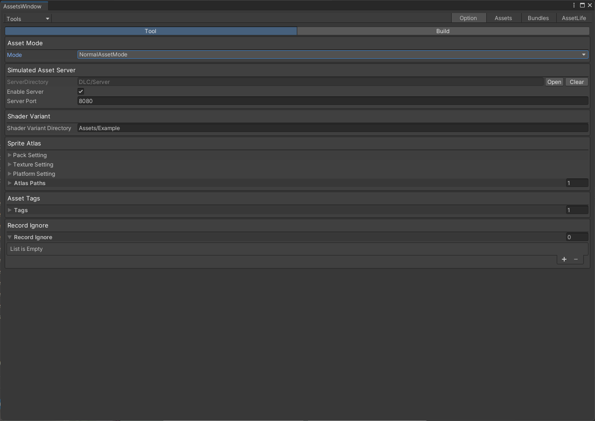

# AssetMOde
* Normal  正式的模式
* Rude    粗鲁的，纯粹的编辑器加载，不需要任何配置
* AssetDatabase  与 Normal 差不多，但是 不需要打包，是编辑器模拟
# AssetServer
* 配合 normal（AssetMOde）使用，快速检查网络加载等问题
* 资源都在 Server 目录下，每次打包都会 把输出的bundle 拷贝到 Server 目录

# Shader Variant 防止 着色器丢失 点击Tools/WooAsset/Help/ShaderVariant

# Sprite Atlas  打图集 点击Tools/WooAsset/Help/SpriteAtlas
* 设置好图集相关设置

# Asset Tags
* 给相应的资源加标记的记录
* 具体操作（在Assets页签，选中资源-》右键）
* 需要先在窗口  AssetTags 中 预设tag
# Record Ignore
* 规定一些资源不记录到资源清单内
* 属于优化选项
* 具体操作（在Assets页签，选中资源-》右键）