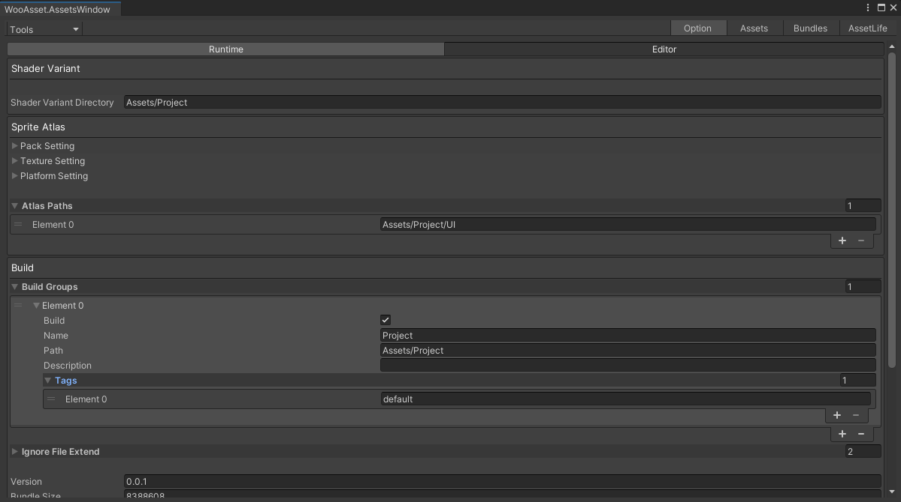

# 配置

| 名字                   | 描述                                   |
| ---------------------- | -------------------------------------- |
| shaderVariantDirectory | svc   输出的文件夹                     |
| atlasPaths             | 需要做图集的文件夹（给一个根路径即可） |
| packSetting            | 图集设置                               |
| textureSetting         | 图集设置                               |
| PlatformSetting        | 图集设置                               |
# 收集着色器变体
* 设置好shaderVariantDirectory
* 点击Tools/WooAsset/Help/ShaderVariant
* 稍等片刻即可完成，内容全都在shaderVariantDirectory目录下

# 生成图集
* 设置好图集相关设置
* 点击Tools/WooAsset/Help/SpriteAtlas
* 稍等片刻即可完成
