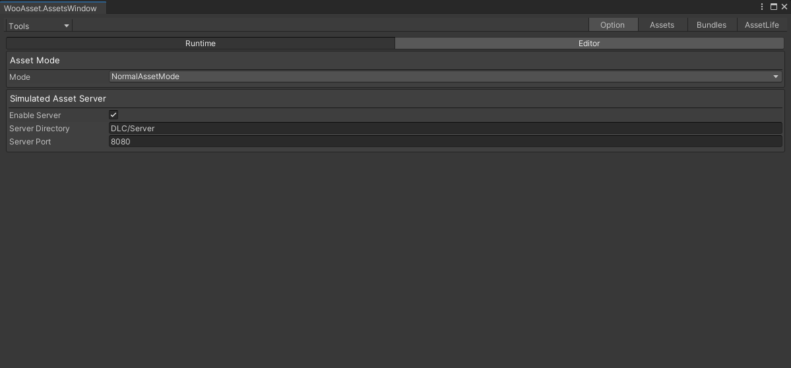

## 模拟资源服务器

* 使用场景
* 省的每次都上传到远端
* 配合资源加载情况窗口一起观察资源加载情况

* 使用方法
* 设置好 Enable Server ，Server Directory ，Server Port
* 编辑器进入运行模式会自动开启资源服务器，console窗口有输出

* 注意
* Server Directory ，Server Port 一般情况默认即可
* 资源服务器只会在运行状态且NormalMode状态下打开
* 如果资源服务器的配置不为空，在打包资源的时候会把输出文件拷贝过去
## 资源加载情况

* 资源加载实践
* 当前有多少引用
* 资源的标签
* 资源所属的 bundle
* 支持快速搜索
## 收集资源预览

* 如果不是打包，会收集所有的buildGroup
* 可以方便的看到究竟打包了什么内容
* 双击资源可以定位
* 支持快速搜索
* 可以查看资源依赖情况
## 构建 Bundle 预览

* 如果不是打包，会收集所有的buildGroup
* 可以预览所有的assetBundle
* 可以查看每一个资源的依赖
* 可以查看每一个bundle的依赖
* 双击资源可以定位
* 支持快速搜索

