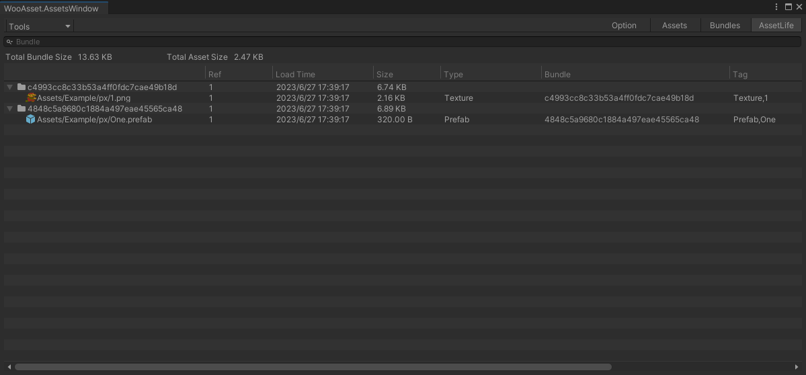
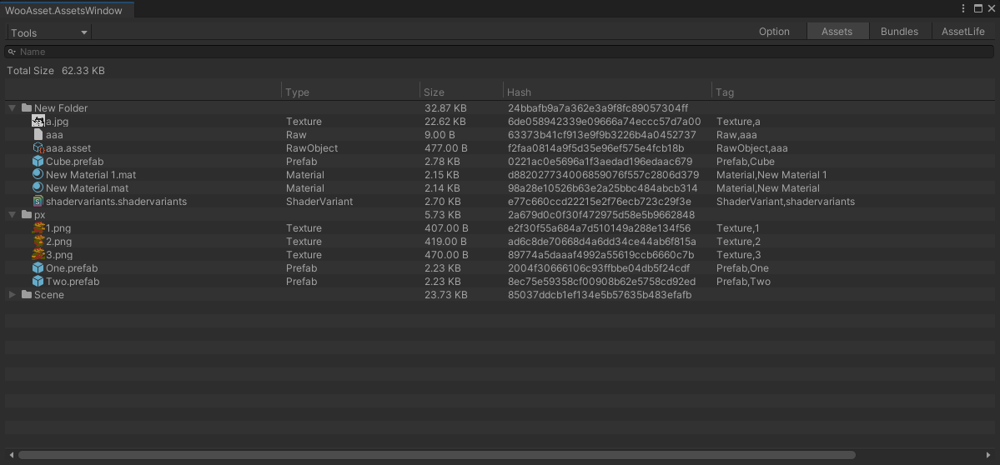
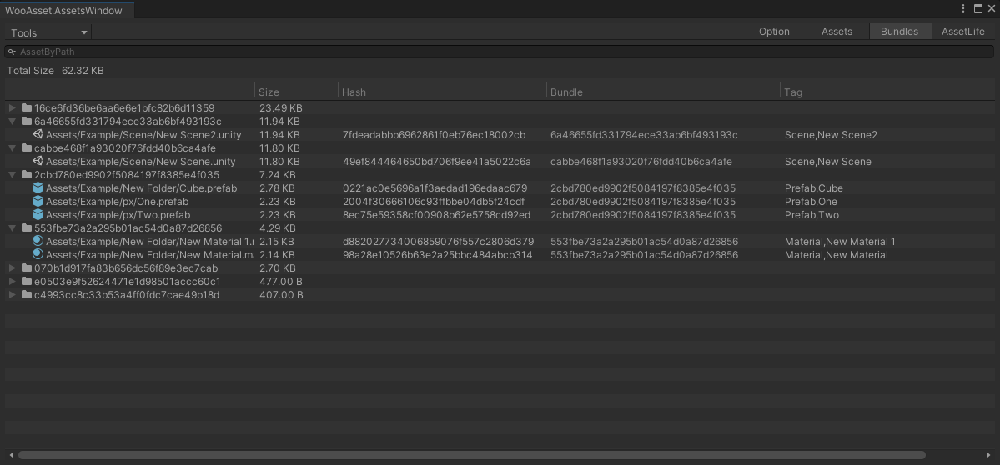

## 资源加载情况

* 资源加载实践
* 当前有多少引用
* 资源的标签
* 资源所属的 bundle
* 支持快速搜索
## 收集资源预览

* 如果不是打包，会收集所有的buildGroup
* 可以方便的看到究竟打包了什么内容
* 双击资源可以定位
* 支持快速搜索
* 可以查看资源依赖情况
## 构建 Bundle 预览

* 如果不是打包，会收集所有的buildGroup
* 可以预览所有的assetBundle
* 可以查看每一个资源的依赖
* 可以查看每一个bundle的依赖
* 双击资源可以定位
* 支持快速搜索

