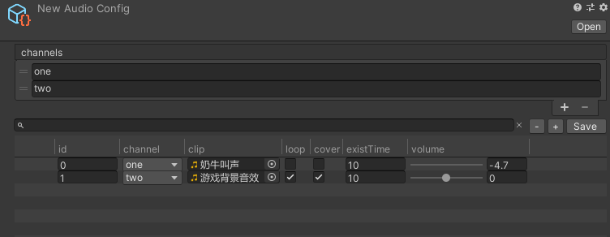

# WooAudio-AudioConfig
AudioConfig文件是WooAudio 插件中的一个核心，用于存储和管理音频资源的配置信息。通过AudioConfig，开发者可以集中定义和调整音频的播放参数，如音量、播放通道、循环设置等，而无需在代码中硬编码这些参数。这使得音频管理更加灵活和高效，特别是在需要频繁调整音频设置的项目中。

# 创建方法
右键Project窗口 - Creat - AudioConfig

# 界面功能介绍
* channels
  * 在Channels部分，添加音频通道。每个通道可以用于不同类型的声音，例如背景音乐、音效等。点击 + 按钮添加通道，并为每个通道命名（例如 BackgroundMusic, SoundEffects）。
* 搜索框
  * 可以通过音频id来搜索对应的配置信息。
* 添加音频数据
  * 在 Sounds 部分，添加音频数据条目。
  * 每个条目包括以下字段：
    * ID：音频的唯一标识符（整数）。
    * Channel：音频播放的通道（从已定义的通道中选择）。
    * Clip：音频文件路径（拖拽音频文件到此字段）。
    * Loop：是否循环播放（勾选此选项）。
    * Cover：是否允许覆盖（即是否允许同时播放多个实例）。
    * ExistTime：音频资源的存活时间（秒），-1 表示永久存在。
    * Volume：音量（范围：-1 到 1）。

