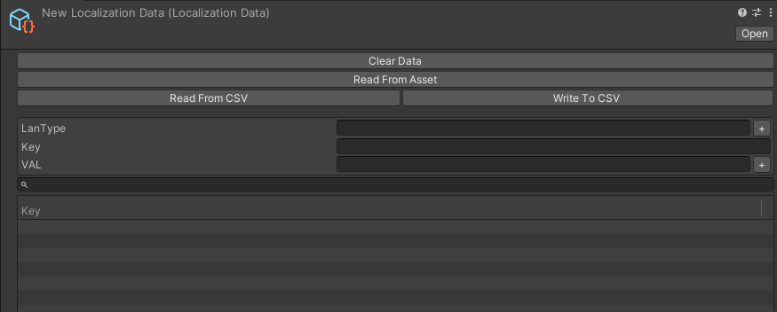

## WooLocalization-Localization Data 是什么
* 存储多语言数据的地方

## 创建方法
* 右键Project窗口 - Creat - Localization Data

## 界面功能介绍
* Clear Data
  * 一键清除所有数据
* Read From Asset
  * 从Assets文件夹中读取数据
* Read From CSV / Write to CSV 
  * 从本地路径中读写CSV文件
* LanType 
  * 语言类型（中文简体、英文、日文、韩文）
* Key
  * 语言的标记
* VAL 
  * 每种语言对应Key的内容

