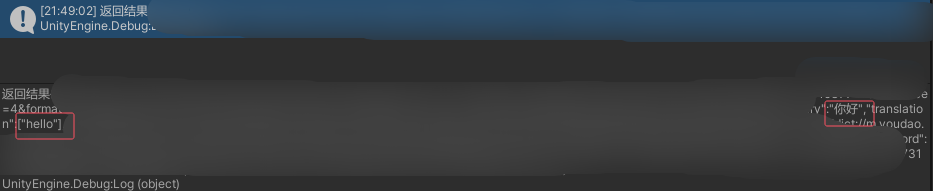

# WooLocalization-Localization Window
Localization的功能界面 

# 内容介绍
* 1.正则表达式相关内容
* 2.有道翻译-文本翻译 输入Appid 和AppSecret 
* 3.设置Localization Data文件 切换语言类型 
* 4.添加TMP扩展脚本


# 接入有道翻译

* 点击Register跳转注册 点击Code&Language跳转Api接入界面


* 如何接入Api
``` csharp
using System;
using System.Collections;
using System.Security.Cryptography;
using UnityEngine;
using UnityEngine.Networking;

public class Test : MonoBehaviour
{
    private string url = "https://openapi.youdao.com/api";
    private string appKey = "你的appKey";
    private string appSecret = "你的appSecret";
    private string salt = Guid.NewGuid().ToString();
    private string curtime = DateTimeOffset.UtcNow.ToUnixTimeSeconds().ToString();
    private string from = "auto";
    private string to = "en";
    private string q = "你好" ;

    void Start()
    {
        string sign = GenerateSign();
        StartCoroutine(SendRequest(sign));
    }
    private string GenerateSign()
    {
        string input = q.Length <= 20 ? q : q.Substring(0, 10) + q.Length + q.Substring(q.Length - 10);
        string signStr = $"{appKey}{input}{salt}{curtime}{appSecret}";
        using (SHA256 sha256 = SHA256.Create())
        {
            byte[] bytes = sha256.ComputeHash(System.Text.Encoding.UTF8.GetBytes(signStr));
            return BitConverter.ToString(bytes).Replace("-", "").ToLower();
        }
    }

    IEnumerator SendRequest(string sign)
    {
        WWWForm form = new WWWForm();
        form.AddField("q", q);
        form.AddField("from", from);
        form.AddField("to", to);
        form.AddField("appKey", appKey);
        form.AddField("salt", salt);
        form.AddField("sign", sign);
        form.AddField("signType", "v3");
        form.AddField("curtime", curtime);
        UnityWebRequest request = UnityWebRequest.Post(url, form);
        yield return request.SendWebRequest();

        if (request.isNetworkError || request.isHttpError)
            Debug.Log("调用接口报错");
        else
            Debug.Log("返回结果"+request.downloadHandler.text);
    }
}

```
