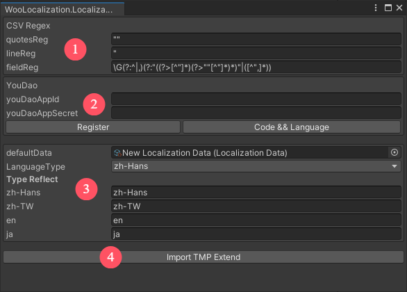
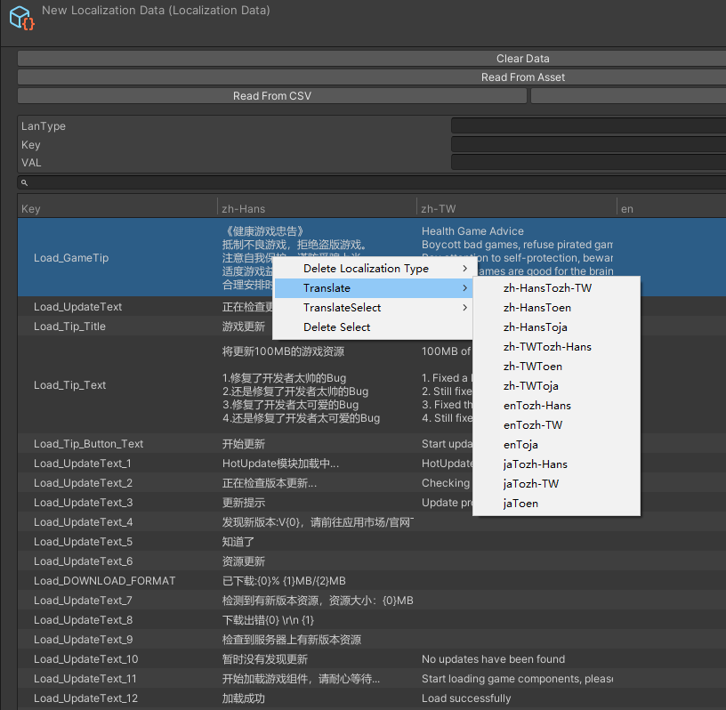

# WooLocalization-Localization Window
Localization的功能界面 

# 内容介绍
* 1.正则表达式相关内容
* 2.有道翻译-文本翻译 点击跳转有道界面注册登录 并申请应用获取id sercet 输入Appid 和AppSecret 
* 3.设置Localization Data文件  设置语言映射 
* 4.添加TMP扩展脚本

# 使用有道翻译

* 点击Register跳转注册 点击Code&Language跳转Api接入界面 
* 填入Appid和AppSecret
* 选择Data文件右键 点击Translate 中指定语言全部翻译

