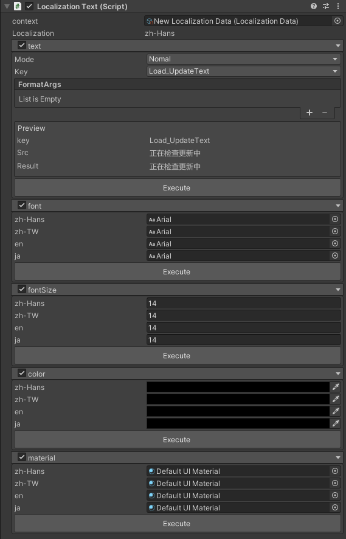
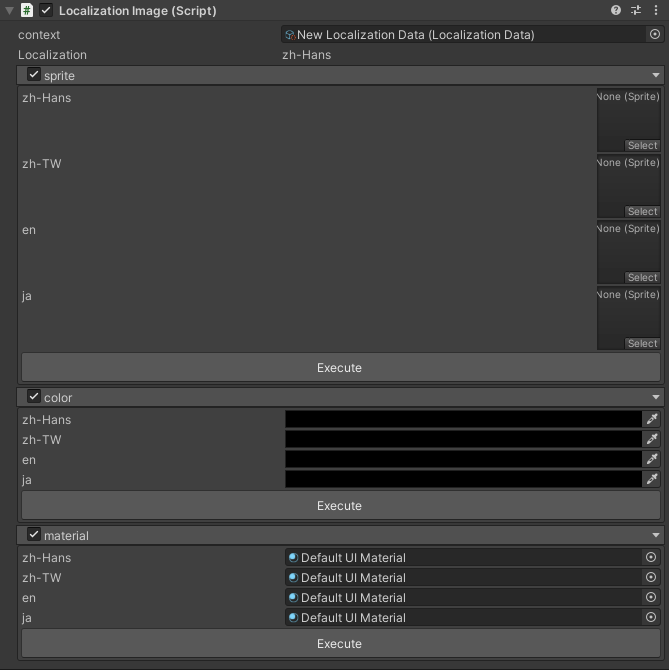
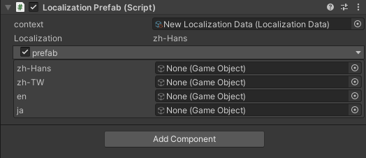
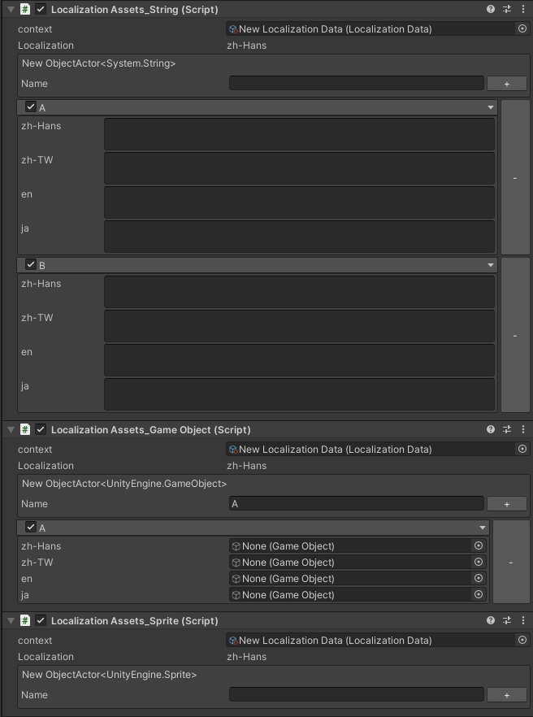

# Text/TMP 组件
  * Context 设置文件
  * Text  
    * mode  
      * 1.Normal：无操作 
      * 2.New Key：输入Key和Value后点击Execute可以更新 
      * 3.Replace Value：重新修改当前key的值
    * FormatArgs 添加占位符的内容
    * Preview 当前语言的Key与Value
  * Font
    * 设置不同语言的字体
  * FontSize 
    * 设置不同语言的字体大小
  * Color 
    * 设置不同语言的文字颜色
  * Material
    * 设置不同语言的材质球



# Image 组件
  * Context 设置文件
  * Sprite
    * 设置不同语言的sprite
  * Color 
    * 设置不同语言的文字颜色
  * Material
    * 设置不同语言的材质球

  


# Prefab 组件
  * Context 设置文件
  * Prefab
    * 设置不同语言要加载的预制体
    

  

# Localization Assets_String/Game Object/Sprite
我们在开发的时候本地化不只处理文字内容，还会处理物体、音频、图片等其他内容
这个组件的作用就是相当于一个配置表，通过代码可以获取到具体的Value

 

``` csharp
public  LocalizationAssets_String asset;

Debug.Log(asset.GetObject("key"));
```
* 其他两个组件同理 

# 如何扩展需要的组件
以Texture类型为例，要实现两个脚本 一个是editor脚本一个是texture类型脚本

``` csharp
using UnityEditor;
using UnityEngine;

namespace WooLocalization
{
        [CustomEditor(typeof(LocalizationAssets_Texture))]
        class LocalizationAssets_TextureEditor: LocalizationAssetsEditor<LocalizationAssets_Texture, Texture>
        {
                
        }
}

namespace WooLocalization
{
        [UnityEngine.DisallowMultipleComponent]
        public class LocalizationAssets_Texture: LocalizationAssets<Texture>
        {
                
        }
}
```


# 如何不使用组件也能使用本地化功能


``` csharp
//调用静态类获取信息
text.text=Localization.GetLocalization("Key")
``` 