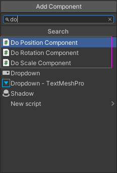
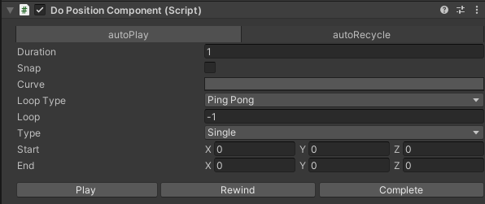
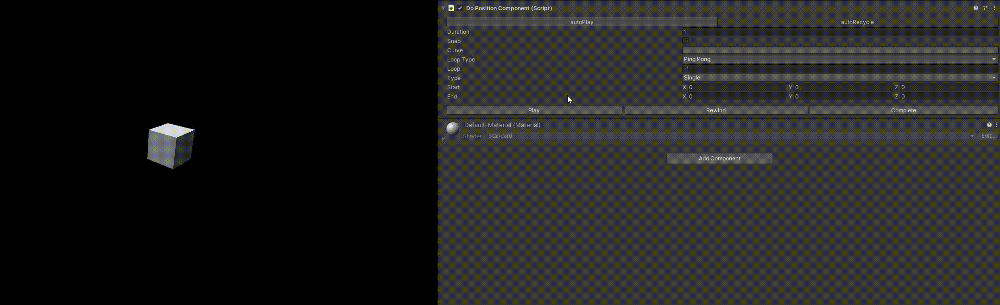
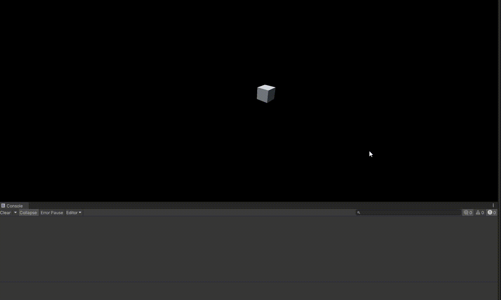

# 开始
* 此篇文章讲一下如何快速使用WooTween
* 根据自己需求怎么去扩展
* 以及重点内容 
  
##  Component
* 之前已经讲解过了Component是个什么东西 
* 这里我们看看如何使用
* 选择物体-添加组件
* 我们可以看到自带的三个组件
  
  
 
* autoPlay: 自动播放 autoRecycle: 自动回收
* Duration：持续时间
* Snap: 简单理解就是勾选后整数的数值来运动
* Curve: 动画曲线 内置了5种曲线 可以自定义 并保存
* LoopType: 循环模式 ReStart PingPong
* Loop: 循环次数 -1无限 1..次数
  * Type: 运动数值的模式 
  * Single 起始点和终点值 
* Array 多个数值组成一条线路
  * Play Rewind Complete 无需运行立即播放动画 倒放回原点 停止动画

 
 

* 使用方法一目了然这里就不过多讲解了 
* 如何扩展呢 我们以BoxCollider2D的Offset为例 
* 我们需要更改的数值为Vector2
* 新建两个脚本
``` csharp
using UnityEngine;

namespace WooTween
{
    public class DoBoxCollider2DComponent : TweenComponent<Vector2,BoxCollider2D>
    {
        protected override Vector2 GetTargetValue()
        {
            //返回物体的缩放值
            return transform.GetComponent<BoxCollider2D>().offset; 
        }

        protected override  void SetTargetValue(Vector2 value)
        {
            //物体的缩放值等于value
            transform.GetComponent<BoxCollider2D>().offset = value;
        }
    }
}


using UnityEditor;
using UnityEngine;

namespace WooTween
{
    [CustomEditor(typeof(DoBoxCollider2DComponent))]
    public class DoBoxCollider2DComponentEditor : TweenComponentEditor<Vector2 , BoxCollider2D> { }
}
```

## TweenEx
 * 所有会调用的方法都在TweenEx脚本里面 
 * 此篇内容讲解一下如何使用和如何扩展

``` csharp
transform.DoMove(new Vecotr3(0,1,2),2,false) .SetLoop(4, LoopType.PingPong)
                  .SetAnimationCurve(curve)
                  .SetRecycle(false)
                  .OnComplete(() =>
                  {
                      Debug.Log(Time.time);
                  });
```
* 传入位置 持续时间 移动数值是否为整型 设置循环 循环类型 设置动画曲线 设置回收 完成时委托内容


``` csharp
ITween t = cube.DoMove(new Vector3[] {
               Vector3.zero,
               Vector3.one,
               Vector3.one * 2,
               Vector3.one * 3,
               Vector3.one * -4,
               Vector3.one * 5,
               Vector3.one * 6,
            }, 5, false)
            .SetRecyle(false);
```
* 也可以以数组的形势传入参数


``` csharp
        private void Update()
        {
            if (Input.GetKeyDown(KeyCode.Space))
            {
                t.Rewind(1);
            }
            if (Input.GetKey(KeyCode.A))
            {
                t.ReStart();
            }
            if (Input.GetKey(KeyCode.Q))
            {
                t.Complete(false);
            }
        }
```
* 也可以对动画进行一系列操作


``` csharp
tc.SetUpdateType(TweenUpdateType.Update).SetDeltaTime(0.1f).SetDelta(0.2f).SetTimeScale(2);
```
* 设置动画的一系列参数


 


## 如何扩展


``` csharp
public static ITween<T> DoGoto<T>(T start, T end, float duration, Func<T> getter, Action<T> setter, bool snap, EnvironmentType env= EnvironmentType.RT) where T : struct
        {
#if UNITY_EDITOR
            if (!UnityEditor.EditorApplication.isPlaying && !Application.isPlaying)
            {
                env = EnvironmentType.Editor;
            }
#endif
            var tween = AllocateSingleTween<T>(env);
            tween.Config(start, end, duration, getter, setter, snap);
            
            (tween as Tween).WaitToRun();
            return tween;
        }
        
public static ITween<T> DoGoto<T>(T[] array, float duration, Func<T> getter, Action<T> setter, bool snap, EnvironmentType env = EnvironmentType.RT) where T : struct
        {
#if UNITY_EDITOR
            if (!UnityEditor.EditorApplication.isPlaying && !Application.isPlaying)
            {
                env = EnvironmentType.Editor;
            }
#endif
            var tween = AllocateArrayTween<T>(env);
            tween.Config(array, duration, getter, setter, snap);
            (tween as Tween).WaitToRun();
            return tween;
        }
```
* 所有的方法扩展主要依靠于这两个函数 传入一个值还是数组
* 现在所支持的包括Transform、Material、Graphic、Light、Camera、CanvasGroup、Text、Image、ScrollRect、GameObject、Behaviour、Toggle、AudioSource、Rigidbody、Rigidbody2D、SpriteRenderer、LayoutElement、Outline、RectTransform、Slider
* 大部分经常会用到的扩展方法都在其中


``` csharp
public static ITween<float> DoFieldOfView(this Camera target, float value, float duration, bool snap = false)
{

   return DoGoto(target.fieldOfView, 
          value, 
          duration, 
          () => { return target.fieldOfView; },
          (value) => { target.fieldOfView = value; }, 
          snap);
}
```
* 以修改相机的FieldOfView为例
* 写一个静态方法 返回值为ITween<数据类型>  
* 第一个方法参数需要是 this + 类型 + 名称 | 传入值 持续时间 Snap
* 方法体里面可以写对传入值的判断 ，比如： 不能小于0 不能大于180
* return 调用DoGoto方法 将之前写的参数一一对应 
* 剩下的事情就不需要我们去管了