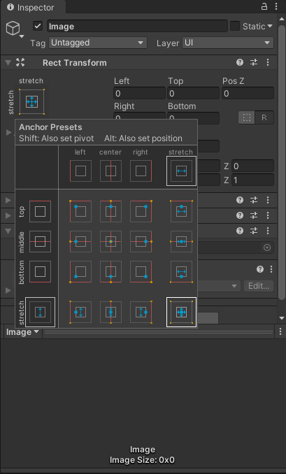

# 分辨率适配
``` csharp
/// CanvasScaler 设置为Scale with Screen Size
public void FitScreen(CanvasScaler scaler)
{
    var width = (float) Screen.width;
    var height = (float) Screen.height;
    var percent = width / height;
    var min = 0.48f; //1125*2346
    var max = 0.75f; //768*1024
    var length = max - min;
    percent = (percent - min) / length;
    scaler.matchWidthOrHeight = percent;
}
```
# 刘海屏
做一个空物体，如下图布局，挂脚本，要是配的放这个空物体下边

``` csharp
[RequireComponent(typeof(RectTransform))]
public class UINotch : MonoBehaviour
{
    private RectTransform rectTransform;
    private void Awake()
    {
        rectTransform = GetComponent<RectTransform>();
    }
    private void Start()
    {
        NotchUISafeAreaSize(rectTransform);
    }
    public static void NotchUISafeAreaSize(RectTransform transform)
    {
        Rect safeArea = Screen.safeArea;
        //下边
        {
            float offset = safeArea.yMin;
            float ratio = offset / Screen.height;
            offset = transform.rect.height * ratio;
            transform.offsetMin = new Vector2(transform.offsetMin.x, offset);
        }
        //上边
        {
            float offset = Screen.height - safeArea.yMax;
            float ratio = offset / Screen.height;
            offset = transform.rect.height * ratio;
            transform.offsetMax = new Vector2(transform.offsetMax.x, -offset);
        }
        //左边
        {
            float offset = safeArea.xMin;
            float ratio = offset / Screen.width;
            offset = transform.rect.width * ratio;
            transform.offsetMin = new Vector2(offset, transform.offsetMin.y);
        }
        //右边
        {
            float offset = Screen.width - safeArea.xMax;
            float ratio = offset / Screen.width;
            offset = transform.rect.width * ratio;
            transform.offsetMax = new Vector2(-offset, transform.offsetMax.y);
        }
    }
}
```