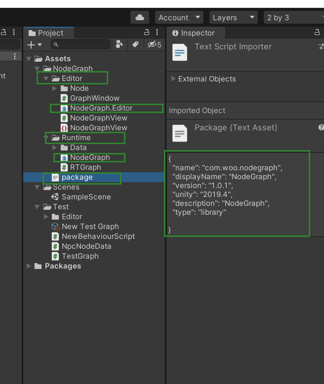

### 发布自己的包
* 1、创建一个正常的unity项目
* 2、在Assets 目录下 创建好内容（必须包含内容如下图）
* 3、把做好的内容推送到主分支
* 4、git subtree split --prefix=Assets/xxx --branch upm
* 5、推送 upm 分支到github
* 6、git tag 1.0.0 upm
* 7、git push origin upm --tags

后续修改只需要重复执行3-7即可
### 安装
* 打开unity package manager
* 点击 add package form git
* 填写 https://github.com/OnClick9927/NodeGraph.git#1.0.1

